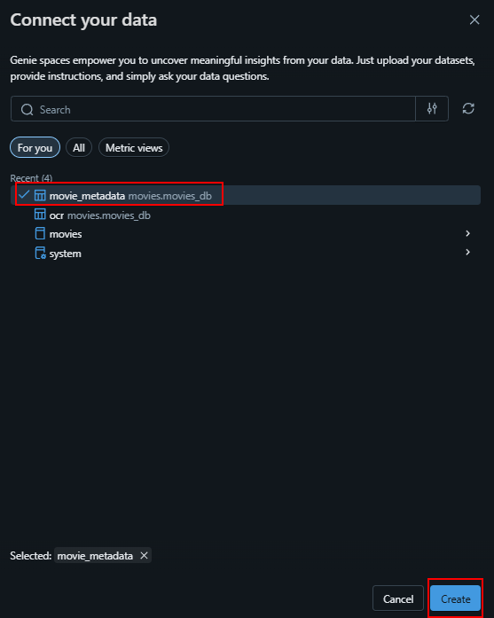

# 🎬 UofC-AI-Agents-Lecture

Welcome to the **AI Agents Lecture**! This guide will walk you through each step to successfully complete the workshop.

---

## 🚀 Step 1: Log in to Databricks

1. Go to the [Databricks Free Edition sign-in page](https://docs.databricks.com/aws/en/getting-started/free-edition#sign-up-for-databricks-free-edition).
2. After signing in, you should see a homepage similar to the one below:

   

---

## 📁 Step 2: Create a Git Folder

- Download the workshop content by creating a **Git folder** in Databricks.

  

---

## 🗂️ Step 3: Set Up Catalog, Schema, and Volume

Before working with the movie data, set up your workspace:

1. **Create a Catalog**  
   - Navigate to the **Catalog** tab.
   - Click **Create Catalog** and name it (e.g., `movies`).

     

2. **Create a Schema**  
   - Within your new catalog, click **Create Schema** and name it (e.g., `movies_db`).

     

3. **Create a Volume**  
   - Inside your schema, click **Create Volume** and name it (e.g., `pdfs`).
   - This is where you'll upload and store your movie PDFs.

     

---

## 🎥 Step 4: Download Movie PDFs from IMDb

1. Visit [IMDb](https://www.imdb.com/?ref_=tt_nv_home).
2. Use the search bar to find 4-5 of your favorite movies.

   

3. For each movie:
   - Press `Ctrl+P` to print the page.
   - Save it as a **PDF**.

     

---

## ⬆️ Step 5: Upload the Movies to Unity Catalog

- Go to your previously created volume.
- Click the **Upload** button and add your movie PDFs.

  

Congratulations, you have now landed data into the Bronze layer!

#TODO Attach image

---

## 🤖 Step 6: OCR the Movies

1. Navigate to `scripts/ocr_movies`.
2. Set the following configs:

   

   - `destinationTableName`: `movies.movies_db.ocr`
   - `limit`: `100`
   - `partitionCount`: `4`
   - `sourceVolumePath`: `/Volumes/movies/movies_db/pdfs`

> **Note:**  
> This script reads files from storage, processes them (using AI for PDFs/images), and stores results in a new table. Errors are tracked, and all processed documents are combined for easy analysis.

3. Click **Run**:

   

> ⏳ *Processing may take a few minutes. When finished, you'll have a table with extracted text from your movie PDFs.*

Congratulations, you have now landed data into the Silver layer!

#TODO Attach image

---

## 🔍 Step 7: Explore the OCR Table

1. Go to the **SQL Editor** tab and create a new query:

   

2. Use this prompt for AI:  
   > *"write me a SQL query that returns all rows in movies.movies_db.ocr"*

   

   The AI should generate:

   ```sql
   SELECT *
   FROM movies.movies_db.ocr
   ```

### 📝 Questions to Consider

- What does the data look like?
- Does the OCR content match the website?

### Side Exploration

As described during the presentation, data is the fuel for AI! We have made amazing progress getting the data into Silver, but results may be limited if we put an chatbot/agent ontop of this data.

Lets test this theory and create a Genie Space. A Genie Space will take a natural language query, and convert it to SQL.

To create a Genie Space, navigate to Genie on the left hand side and create a new space:


After clicking the 'Create' icon, we need to import our ocr table:


Next we pass through a question to Genie, make sure to substitue your_movie with one of the movies you downloaded from IMDb:


In my case, I have brought in the movie "Jaws", so I will ask my question accordingly. You will notice the agent is unable to anwser the question:


#### 📝 Questions to Consider

- What did you learn from this side exploration?
- Is the data ready for AI to use it?

---

## 🧠 Step 8: Extract Movie Metadata Using AI

- Create a new query and use this prompt for AI:  
  > *"using the ai_extract function to extract director, year_filmed, cast on the table movies.movies_db.ocr on the text column, create a column for each and write the output to movies.movies_db.movie_metadata"*

  

AI should write a query similar to this:

```sql
CREATE OR REPLACE TABLE movies.movies_db.movie_metadata AS
SELECT
  path,
  text,
  ai_extract(
    text,
    ARRAY('director', 'year_filmed', 'cast')
  ) AS extracted_entities,
  extracted_entities['director'] AS director,
  extracted_entities['year_filmed'] AS year_filmed,
  extracted_entities['cast'] AS cast
FROM movies.movies_db.ocr;
```
Congratulations, you have now landed data into the Gold layer!

### 📝 Questions to Consider

- Is the data ready for AI to use it?
- Is there additonal metadata we should extract?

---

## 🗺️ Step 9: Explore the Metadata Table

Before we put an agent on top of our gold data, lets make sure we understand the contents of the table.

- Create a new query and use this prompt for AI: 
   > *"create a query to select all rows from movies.movies_db.movie_metadata"*


The query returned from the AI should look something like this

```sql
SELECT * FROM movies.movies_db.movie_metadata;
```

### 📝 Questions to Consider

- Did the AI extract the metadata properties correctly (ex: is the director correct?)?
- Do you think the agent will be better able to interact with this data? 

## Step 10: Create a Genie Space on the Gold Data

After all that hard work, now we can finally create our agent!

We will create a new Genie Space and bring in our new metadata table



Also make sure you rename the Genie Space to something meaninigful:


Next, lets take that same question we asked during our 'side exploration' in step 7.


If all goes well, the agent should be able to anwser the question!

✅ Lesson Learnt: Good data is critical for AI to work well.

## Step 11: Bring in a new Dataset

Awesome work making it this far!

This step can be completed either during our session today, or later on your own time.

The idea here is to repeat all of the above steps on a different dataset. Perhaps you could pull sports data (MLB, NHL etc.) and get the data all the way to gold.

Once in gold, augment your existing Genie Space from step 10 and add that table into it for use.

### 📝 Questions to Consider

- How does the Genie agent decide which table to query based on the users question?
- Does the agent do a good job of deciding which dataset to query?


